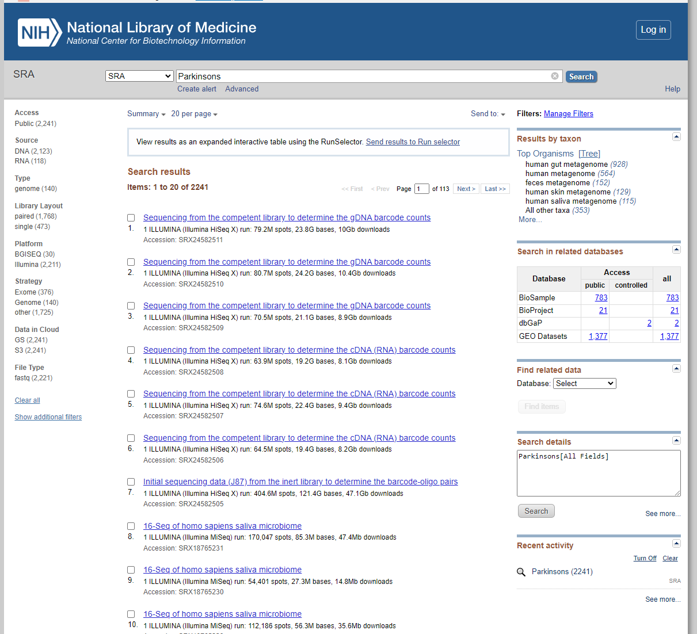
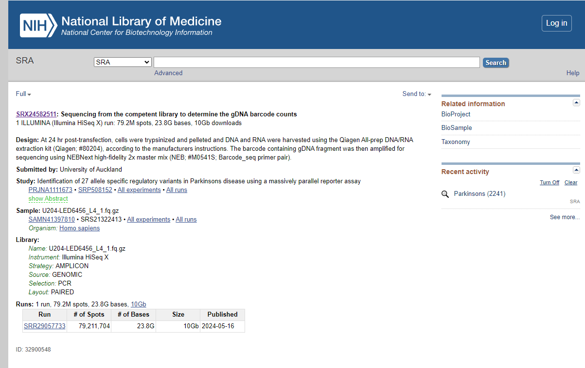
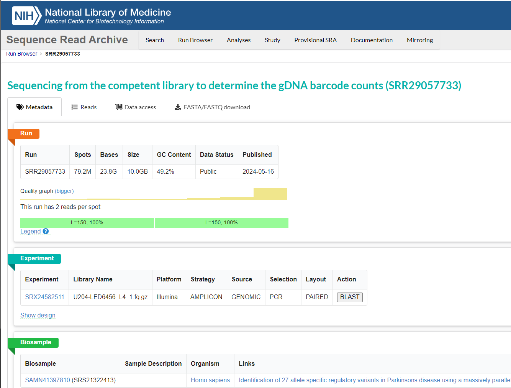
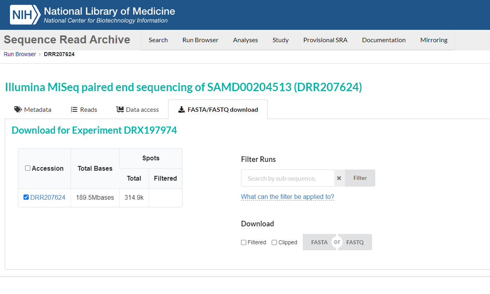
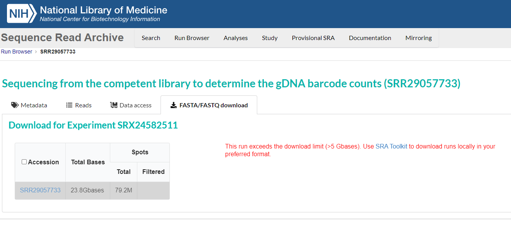

# Sample Set Creation by Gathering Data

Objective: Learn how to gather data from the NCBI database to create a sample set of genomes for a specific research topic.

Bioinformatics research involves using comparative analysis between genomes to search for correlations between reoccurring patterns in the growing body of genetic sequences and the characterics of the organisms that contain these genetic sequences. Often this is done by creating a model that uses features of the genomes to make a prediction about the organism. The features are often derived from the genetic material itself (for example Kmers), or from other sources such as gene expression data. Since these sequence patterns can be quite small compared to a genome or metagenome, it is often difficult to find them without machine assistance, so we use bioinformatics tools to help us find them and analyze them.

One of these tools is the representative genome set that you created in the first unit. Another tool is the hammer set that you created in the second unit. The [Bacterial and Viral Bioinformatics Resource Center (BV-BRC)](https://bv-brc.org/) supports many bioinformatics analysis tools in addition to being a repository of nearly all sequenced bacterial and viral genomes. The [National Center for Biotechnology Information (NCBI)](https://www.ncbi.nlm.nih.gov/) is a repository of both genomic and metagenomic information, which can be programmatically accessed via the tools within the `sratoolkit` that you installed at the beginning of this course. We are now going to use these tools to create a simple version of an even more powerful class of tools: A machine-learning model that we can use to either diagnose a disease or create a treatment to target the disease. To do this, we will need to gather data from the NCBI database that is relevant to the research topic we are interested in.

## Materials

* [Grimoire](https://chat.openai.com/g/g-n7Rs0IK86-grimoire)

* [NCBI](https://www.ncbi.nlm.nih.gov/)

* [The SRAToolkit's "Download FASTA" Documentation](https://www.ncbi.nlm.nih.gov/books/NBK242621/)

```
FIG-Bioinformatics-Course/
└── 3_Projections
    └── 3.1_Sample-Set-Creation/
        └── Sample-Set-Creation Exercise-1_Gather_Data.md (you are here)
```

## Exercise

**ALWAYS RESET YOUR PATH** --- Type `source ~/.bashrc` into your command line to reset your path to the Course directory before starting each exercise.

1. Ask Grimoire to describe the different types of machine learning models that can be used to predict the presence of a disease based on metagenomic data. Specifically mention that you are interested in classification methods such as the "random forest" model.

2. Ask Grimoire how one would construct a metagenomic sample set suitable for training a random-forest model.

3. The machine learning model that we are going to create is a classification model.
This model basically takes a set of samples that have been categorized into diseased or healthy groups and uses that as a key to determine what the pattern for each group is.
Then it uses the genomes found within a mystery sample to make a prediction about the health status of that sample.
Kind of like we were doing on a smaller scale in the previous units, we will be doing it on a larger scale and with a lot more data.
In general, using more data will lead to a more accurate model and allow us to make more accurate predictions, albeit it is imporatant that the data also be of sufficiently high quality.

   Below are a list of suggested research topics that might be of
interest as objectives for disease-state prediction using classification.
Choose one of the topics below. If you would like to choose a different topic, do a little research first to ensure that the gut microbiome has been studied for that specific topic. Otherwise it is possible that your machine learning model will not be able to distinguish between the two groups and will not be able to make accurate predictions.

   1. **Obesity**
   2. **Type 2 Diabetes**
   3. **Inflammatory Bowel Disease (IBD)**
   4. **Mental Health**
   5. **Dietary Allergies**
   6. **Autoimmune Diseases**
   7. **Alzheimer's Disease**
   8. **Parkinson's Disease**

4. Now that we have chosen a research topic, we need to gather data from the NCBI database. Please go to https://www.ncbi.nlm.nih.gov/ and enter the topic of your choice into the search box. The search-result will look something like the image below, listing the NCBI database-entries that at may be relevant to your search-topic.


First, note the Literature section, which contains links to various indices of research papers and articles that are relevant to your topic.
A literature search can give you a good idea of what is currently known about your topic and can help you understand the current state of research. You will find that many published papers will contain a "Data" section that links back to NCBI or to some other public data-repository. If you want to find data this way, click on "PubMed", which will display NCBI's index of papers relevant to your search-topic, with links to their abstracts. Make sure you pay attention to the Data Availability section of each paper as well as the authors. Often times an author will use the same data set for multiple publications, and if they do you might end up with duplicate data if you use more than one of their papers.

Next we have the Genomes section. This section will give you any and all genomes that have been tagged with your specific topic. Depending on your need, you can choose to look at the `BioProject`, which links to a record of the samples associated with a given research project, or to `BioSample` which links to a record of individual samples from a given experiment, or to `SRA` ("Sequence Reads Archive") which is a repository of the raw data for most publically-available samples. 

Click on the SRA heading to see all the data we are looking for:


5. The SRA search-page lists the set of samples that were tagged as relevant to your topic. Each entry has a link, a description of metadata for the sample, and an Accession number underneath it. Ask Grimoire to describe what "spots" and "bases" are referring to in terms of a metagenome sample. 

6. Good Data is important. It keeps our classifier accurate and our predictions useful. However, having an overwhelming abundance of data is the only way to ensure that our model can identify enough of a pattern to make an accurate prediction. In this way, we need to find a balance between the number of samples that we use and the quality of the data that we gather. If you click on any of the links inside of your search, you will find a page with all the metadata associated with that sample: 



7. Another thing we need to keep in mind is the variables that are associated with our choice of data. For example, if we were trying to classify apples as bruised or not bruised, and then never included a green apple, it is possible that our model would not be able to classify the green apple correctly because it does not have any data on green apples. In the same vein, we also need to make sure that we include a diverse set of samples. However too much diversity can be problematic as well. If we included every type of apple as well as every type of banana, and if there are many more examples of apples than bananas, it is possible that it would classify all bananas as apples and give us a very inaccurate prediction. Therefore we need to be sure that we keep some variables constant so that we can make accurate predictions. 
We therefore need to keep the metadata variables that are not believed to be directly relevant to our classification task constant.
In our "fruit" analogy, if we are trying to classify apples as red, green, or yellow, we would not want to mix in bananas.
If all of our samples are processed the same way, then we filter out all of the "banana" samples and keep our classification to only the apples so as not to confuse our model. Thus, when choosing your data, notice whether it is from the gut microbiome, saliva, blood, or other type of samples; these are all different sources of data and can effect how our model performs. For example, you would not want to mix gut samples with saliva samples, because doing so might cause your classifier to unintentionally learn to distinguish gut-samples from saliva-samples, instead of "diseased" vs "healthy" samples.
Notice that the Library section of the metadata includes Strategy, Source, Selection, and Layout. We want these variables to also be constant across our samples with Strategy and Layout being the most important. Ask Grimoire to describe what Amplicon vs Whole Genome Shotgun (WGS) Sequencing are, and what the differences are between the two.
(The amplicon vs WGS distinction is particularly important
for our approach, because a hammer-analysis will only work on WGS data.)

**Note: Keeping the process constant means that only the genetic material variables will be considered inside of the model. Those are the only variables that we want to be more diverse.**

8. Notice also that each of the SRA entries have a `Run` associated with it. The word `Run` is short for "Sequencing Run", and is synonymous with the metagenomic sample that we are looking at.
"Runs" are usually assigned either an "SRR" or an "ERR" identification number;
"SRR" means that the sequencing-run was originally deposited at NCBI,
whereas "ERR" mean that the sequencing-run was originally deposited
at NCBI's European analog, "EBI".
Click on the Run to see the Sequence Read Archive entry,
and the information associated with the run: 



9. The SRA webpage will have a tab inside that says "FASTA/FASTQ Download". This is a webpage that will allow you to download a FASTA or FASTQ file that you can then use with your hammer set and representative genome set if the sample is from a "Whole-Genome Shotgun" (WGS) run (NOTE: hammers only work on WGS samples; "Amplicon" samples require a different analysis method.): 




10. Sometimes the FASTQ file is too big to download from the webpage. In this latter case you can use the command line to download the data using the SRA run accession number. If you have not already installed the SRA toolkit, now would be a good time to do so.

**NOTE TO DEVELOPERS: WE HAVEN'T YET WRITTEN INSTRUCTIONS FOR INSTALLING THE SRATOOLKIT!!! :-(**

Once you have installed the SRA toolkit, you can use the following command to download the data. **NOTE: Be sure to replace the dummy-ID "SRR12345678" with your own SRA run accession number**:

```
prefetch SRR28748153
```



Because sample files are often quite large, a download can take a long time (sometimes even several hours), and if the file-download gets interupted, you might have to start over.
Therefore, we use `prefetch`, which is a special SRA-command that is designed to pick up interrupted downloads where they left off.

11. After you have downloaded a single paired-end SRA run, you can use the following command to convert the data into a pair of FASTA files **Again, be sure to replace "SRR12345678" with your own SRA run accession number**:

```
fastq-dump --fasta 0 --split-files SRR12345678 -O Data/Sample_FASTA
```

The result should be a pair of FASTA files for each SRA entry that you process,
so for the example SRA-ID, using the `ls` ("list") command
on the output directory `Data/Sample_FASTA` you would see:

```
ls Data/Sample_FASTA
   SRR12345678_1.fasta SRR12345678_2.fasta
```

12. Follow these steps to download and convert your data for the rest of the samples in your search. Note that this process can take a very long time depending on how many samples you have. But the more samples you have, the more accurate your model will be. For now, download and convert 10 samples so that you have enough data to test your programs. Once you are done, make sure that all of your samples are included in the Data directory of this course to make them easier to access later.

13. The above procedure, while straightforward, will become
quite tedious if you have many samples to download.
Fortunately, we can ask Grimoire to automate the process for us!
Enter the following prompt into Grimoire, and then save the prompt,
pseudocode, and Python code into the template for `sra_download.py`
as usual:

```
Write a Python script named "sra_download.py"
that automates the download of paired-end SRA data
and converts it directly into FASTA format without
using external tools like seqtk.
The script should be fully functional and ready to run
on a system where the SRA Toolkit is installed.

The script must support the following command-line arguments:
- "-i" or "--id-file": A required argument specifying a file
   that contains a list of SRA IDs, one per line.

- "-d" or "--download-directory": A required argument specifying
   the directory where the processed FASTA files should be stored.

- "-c" or "--sra-cache": An optional argument specifying a directory
   to be used as a cache location for SRA downloads.

- "-D" or "--Debug": An optional flag to enable debug output.

### Script Behavior:
1. Read the list of SRA IDs from the specified file.
2. Use the "prefetch" command to download the corresponding SRA files
   into the cache directory (or the default "~/.ncbi/public/sra/" location
   if no cache directory is provided).
3. Ensure that the downloaded ".sra" file exists in the expected location
   before proceeding.
4. Use "fastq-dump --fasta 0 --split-files" to convert the downloaded
   SRA file into a pair of FASTA files (for paired-end reads)
   or a single FASTA file (for single-end reads).
5. Store the resulting FASTA files in a subdirectory under the specified
   download directory, named after the corresponding SRA ID.
6. Perform error handling at every step:
   - If "prefetch" fails, print a warning and move to the next SRA ID.
   - If "fastq-dump" succeeds, delete the cached .sra file;
     elseif "fastq-dump" fails, print a warning and move to the next SRA ID.
   - If no FASTA files are created, print a warning.
7. Ensure all informational messages (`[INFO]`) and debugging messages
   (`[DEBUG]`) are printed to STDERR.
8. Debug messages should only be printed if the script is invoked
   with the `-D` or `--Debug` flag.
9. After processing all SRA IDs, print a summary that includes:
   - The total number of SRA entries requested.
   - The number of successful conversions.
   - The count of single-end and paired-end datasets.

### Implementation Requirements:
- Use "subprocess.run()" to execute system commands;
   also send STDOUT and STDERR from the system commands
   to STDOUT and STDERR for the script.
- Ensure all output directories exist before writing files.
- Send all informative and progress messages to STDERR,
   and in "Debug" mode also print all system-commands to STDERR.
- Use readable function names and modular code organization.
- Print all informational messages and warnings to STDERR.
```

To test your program, create a file containing a single SRA-ID;
a convenient way of doing this is as follows:

```
echo SRR8933535 > Data/sra_test.tbl
```

Then invoke your download-program as follows:

```
python3 Code/sra_download.py -i Data/sra_test.tbl -c Data/SRA_Cache -d Data/SRA_Test
```

If the program completes successfully, then the "disk-usage" command
`du -sh Data/SRA_Test/SRR8933535/*` should return the following:

```
du -sh Data/SRA_Test/SRR8933535/*
928M    Data/SRA_Test/SRR8933535/SRR8933535_1.fasta
928M    Data/SRA_Test/SRR8933535/SRR8933535_2.fasta
```


14. Please note that for our test, we chose a single fairly small sample.
However in general, if you are downloading many files,
or the files are large, or your internet-connection is slow,
your download could potentially take multiple hours.
To deal with possible download interruptions, 
the script generated by the prompt above makes use of the SRA-command
`prefetch`, which as noted earlier is designed to pick up interrupted downloads where they left off.


# Self-Check

(TBA)


